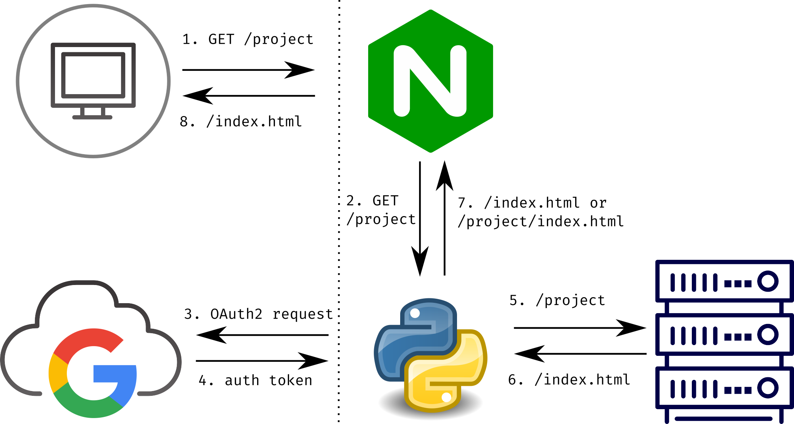

# :open_book: ThunderDocs

## Intro

A grande maioria dos projetos da computação da equipe são documentados seguindo a convenção [Doxygen](http://www.doxygen.nl/), que se auto intitula

> The _de facto_ standard tool for generating documentation from annotated C++ sources

Uma das principais funcionalidades do Doxygen é gerar arquivos de documentação no formato HTML, que permite o acesso online dos documentos gerados. Nós poderíamos facilmente utilizar uma [action do github](https://github.com/marketplace/actions/doxygen-action) pra gerar a documentação automaticamente e acessar pelo [GitHub pages](https://pages.github.com/), aproveitando a hospedagem do próprio GitHub. No entanto, o próprio GitHub exibe a mensagem de alerta 

> Caution: This repository is private but the published site will be public.

As páginas do GitHub pages são abertas para todos e não é interessante que qualquer pessoa tenha acesso a esses arquivos. A documentação de um projeto é mais importante do que o próprio código-fonte (melhor do que conseguir o bolo é conseguir a receita do bolo)

Pensando nesse problema, criamos um conjunto de configurações para um servidor [nginx](https://www.nginx.com/) com autenticação pelo Google, de modo que qualquer pessoa com email @thunderatz.org é capaz de acessar a página. A autenticação é feita por meio de um app [Flask](https://flask.palletsprojects.com/en/1.1.x/) (framework python) que faz a requisição para o site do Google e faz o gerenciamento da sessão do usuário.

 ## Estrutura das requisições
 
 

1. Um cliente faz uma requisição para o algum endereço dentro do docs.thudneratz.org
2. O servidor nginx consulta a aplicação Flask para saber se o cliente está autenticado
    1. Caso o cliente tenha se autenticado previamente, a aplicação responde prontamente com um [código http](https://http.cat/) 202 (requisição aceita)
    2. A autenticação é salva nos cookies da sessão do navegador
3. Caso o cliente ainda não tenha se autenticado, o usuário é levado à página /login para autenticação com a conta do Google
4. Caso os dados sejam válidos, o servidor do Google responde com um token de acesso
5. Uma vez com o token de acesso, a aplicação Flask salva o token nos cookies da sessão e responde o nginx se a operação de autenticação foi bem sucedida
    1. Qualquer código 2xx será interpretado pelo nginx como autenticação bem sucedida enquanto qualquer código 4xx será interpretado como falha na autenticação
6. Se a operação foi bem sucedida, o nginx puxa os arquivos na pasta requisitada
7. O arquivo .html correspondente é carregado
8. O cliente recebe o arquivo requisitado

Para saber mais sobre autenticação OAuth com nginx, veja [esse link](https://www.nginx.com/blog/validating-oauth-2-0-access-tokens-nginx/) e [essa pergunta](https://stackoverflow.com/questions/55719659/using-flask-login-to-authenticate-nginx-reverse-proxy) no StackOverflow e [essa](https://www.ruby-forum.com/t/is-there-setting-equivalent-to-proxy-set-header-for-uwsgi/210778) no ruby-forum pra saber como redirecionar requisições de autenticação para o Flask.

## Configurações

Para fazer o deploy da aplicação Flask, é necessário configurar o [uWSGI](https://uwsgi-docs.readthedocs.io/en/latest/), que será o programa que irá fazer a interface web com o python. Recomendo [esse tutorial](https://www.digitalocean.com/community/tutorials/how-to-serve-flask-applications-with-uswgi-and-nginx-on-ubuntu-18-04-pt) da DigitalOcean.

### Primeiro deploy

O arquivo trdocs.service deve ser copiado para a pasta /etc/systemd/system/

```bash
sudo cp ./trdocs.service /etc/systemd/system/trdocs.service
```

Para iniciar o serviço, digite

```bash
sudo systemctl start trdocs
sudo systemctl enable trdocs
```

Para fazer a configuração dos certificados de https, utilizamos o [certbot](https://certbot.eff.org/). Para o novo domínio, precisamos gerar novos certificados. REcomendo seguir o tutorial oficial, que é bem completo e explicado


## Desenvolvimento local

Para desenvolvimento local, é necessário que o servidor local tenha suporte a https. Para fazer essa configuração, recomendo [esse tutorial](https://adrianorosa.com/blog/nginx/configurar-nginx-https-server-com-self-signed-ssl-certificado.html). Vou deixar como referência também [esse guia](https://blog.miguelgrinberg.com/post/running-your-flask-application-over-https) com o passo a passo desde o desenvolvimento local até o deploy

No nosso servidor, os certificados https já estão configurados corretamente


